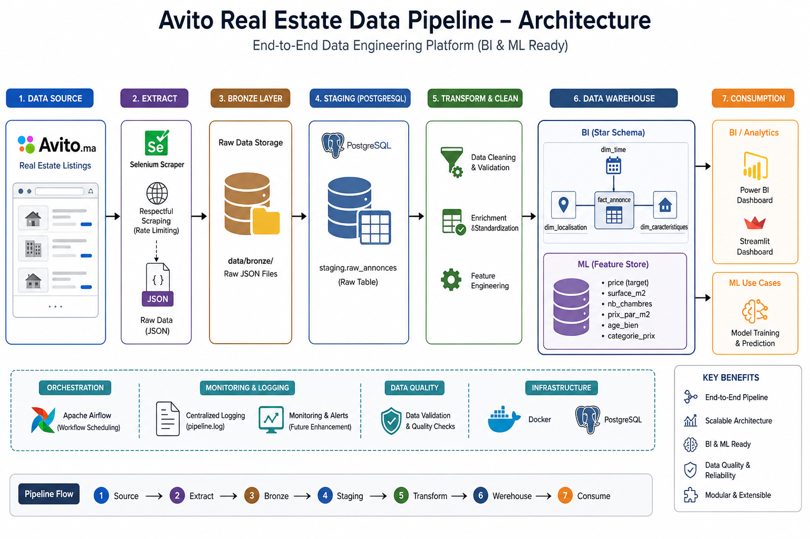

# 🚀 Avito Real Estate Data Pipeline

End-to-end data engineering project that transforms raw real estate listings from **Avito.ma** into analytics-ready datasets and machine learning features.
---
## ⚠️ Disclaimer

This project is for educational purposes only.  
No personal data is collected or stored.  
Scraping is performed on publicly available listings with respectful rate limiting.
and all the data will not be shared and will be deleted within 2 weeks
---

## 🎯 Project Overview

This project simulates a **production-grade data pipeline**:

* Extracts real estate listings via web scraping
* Processes and cleans raw data
* Loads structured data into a PostgreSQL Data Warehouse
* Serves analytics (BI) and Machine Learning use cases

---

## 🧱 Architecture



**Flow:**

```
Selenium Scraper
      ↓
Bronze Layer (JSON)
      ↓
PostgreSQL Staging
      ↓
Cleaning & Feature Engineering
      ↓
Data Warehouse (Star Schema)
      ↓
Power BI Dashboard
      ↓
ML Feature Store (OBT)
```

---

## 🛠️ Tech Stack

* **Python** → ETL & scraping
* **Selenium** → Data extraction
* **PostgreSQL** → Data warehouse
* **SQL** → Transformations & analytics
* **Docker** → Environment orchestration
* **Streamlit / Power BI** → Data visualization

---

## 📊 Business Use Cases

* Track real estate price trends across cities
* Compare price per m² by location
* Identify high-value investment zones
* Build ML models for price prediction

---

## 🗂️ Project Structure

```
data_pipeline/
├── data/
│   ├── bronze/        # Raw JSON data
│   ├── silver/        # Cleaned CSV data
│   └── gold/          # Final outputs (BI/ML)
├── logs/
│   └── pipeline.log
├── src/
│   ├── extract/
│   ├── staging/
│   ├── clean/
│   ├── warehouse/
│   ├── utils/
│   └── main.py
├── tests/
├── docs/
├── docker-compose.yml
├── Dockerfile
├── requirements.txt
└── .env
```

---

## 🏗️ Data Warehouse Design

### Schemas

| Schema    | Purpose                   |
| --------- | ------------------------- |
| staging   | Raw temporary data        |
| clean     | Cleaned + enriched data   |
| bi_schema | Star schema for analytics |
| ml_schema | Feature store (ML)        |

### ⭐ Star Schema (BI)

```
fact_annonce
   ├── dim_localisation
   ├── dim_caracteristiques
   └── dim_temps
```

### 🤖 Feature Store (ML)

```
feature_store
→ prix (target)
→ surface_m2
→ nb_chambres
→ prix_par_m2
→ age_bien
→ categorie_prix
```

---

## 🔄 Pipeline Workflow

```
run_scraper()        → bronze/*.json
run_staging()        → staging.raw_annonces
run_clean()          → clean.annonces
run_bi_schema()      → bi_schema tables
run_ml_schema()      → ml_schema.feature_store
_cleanup_staging()   → cleanup
```

---

## ⚙️ Engineering Highlights

* Idempotent data loading (`ON CONFLICT DO NOTHING`)
* Retry mechanism (3 attempts)
* Modular pipeline design
* Centralized logging system
* Data validation & type handling

---

## 🐳 Setup & Installation

### 1. Clone repository

```bash
git clone <repo_url>
cd data_pipeline
```

### 2. Setup environment

```bash
python -m venv venv
source venv/bin/activate
pip install -r requirements.txt
```

### 3. Configure environment

```
DB_HOST=
DB_PORT=
DB_NAME=
DB_USER=
DB_PASSWORD=
```

---

## 🚀 Run the Pipeline

### Using Docker

```bash
docker-compose up --build
```

### Local execution

```bash
docker-compose up postgres -d
python src/main.py
```

---

## 📊 Dashboard Preview


---

## 🔌 Power BI Integration

1. Connect to PostgreSQL
2. Import `bi_schema` tables
3. Use relationships for analysis

---

## 🧪 Testing (Optional)

```bash
pytest
```

---

## 🛡️ Data Ethics & Compliance

* No personal data collected
* Only public listings used
* Respectful scraping (rate limiting)
* Full pipeline logging

---

## 🧠 Why This Project Stands Out

* Implements **Medallion Architecture (Bronze/Silver/Gold)**
* Separates **BI and ML workloads**
* Uses **Star Schema** for analytics
* Includes **Feature Store for ML**
* Designed like a real-world data platform

---

## 👤 Author

**BRAHIM BADRE** – Data Engineering & Analytics Enthusiast

---

## ⭐ Support

If you found this project useful, consider giving it a star ⭐
